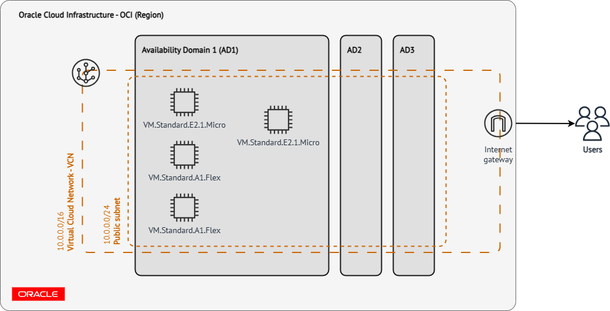
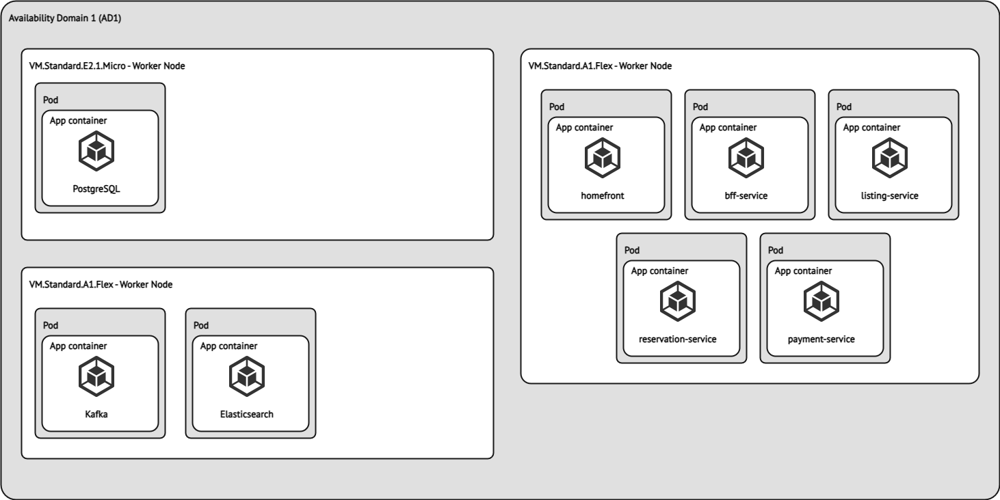

# NodeJS MSA

We try to build a simple room booking to make the best practices NodeJS in MSA. 

## Technical stack

* [TypeScript](https://www.typescriptlang.org) language
* [NodeJs](https://nodejs.org) / [NestJS v9](https://github.com/nestjs/nest)
* [NextJS v13](https://nextjs.org)
* [Flutter v3.3](https://flutter.dev)
* [goauthentik](https://goauthentik.io)
* [Kafka](https://kafka.apache.org)
* [PostgreSQL](https://www.postgresql.org)
* [Docker](https://www.docker.com)
* [Terraform](https://www.terraform.io)
* [FluxCD](https://fluxcd.io)
* [kubernetes](https://kubernetes.io)

## Software Architecture

| NO | Service             | Language    | Description                                                                                                  |
| -- | ------------------- | ----------- | ------------------------------------------------------------------------------------------------------------ |
| 1  | homefront           | Typescript  | Homepage for listing all available rooms, show room detail, price and provide reservation function to guest. |
| 2  | merchant app        | Dart        | Provide a mobile app for merchant to manage their rooms, view booking detail, ...                            |
| 3  | admin app           | Typescript  | A web application for admin to manage users, rooms and bookings                                              |
| 4  | BFF                 | Typescript  | Prepare a GraphQL gateway for homefront, merchant app to communicate with internal services                  |
| 5  | identity            | Go          | Provide OIDC authentication                                                                                  |
| 6  | listing-service     | Typescript  | Lists rooms, views room detail, price...                                                                     |
| 7  | reservation-service | Typescript  | Manage room reservation                                                                                      |
| 8  | payment-service     | Typescript  | Processes payment                                                                                            |
| 9  | message-broker      |             | A Kafka instance                                                                                             |

## Development

See the [Development guide](docs/development-guide.md) to learn how to run and develop this app locally.

## Infrastructure

## Sponsors

