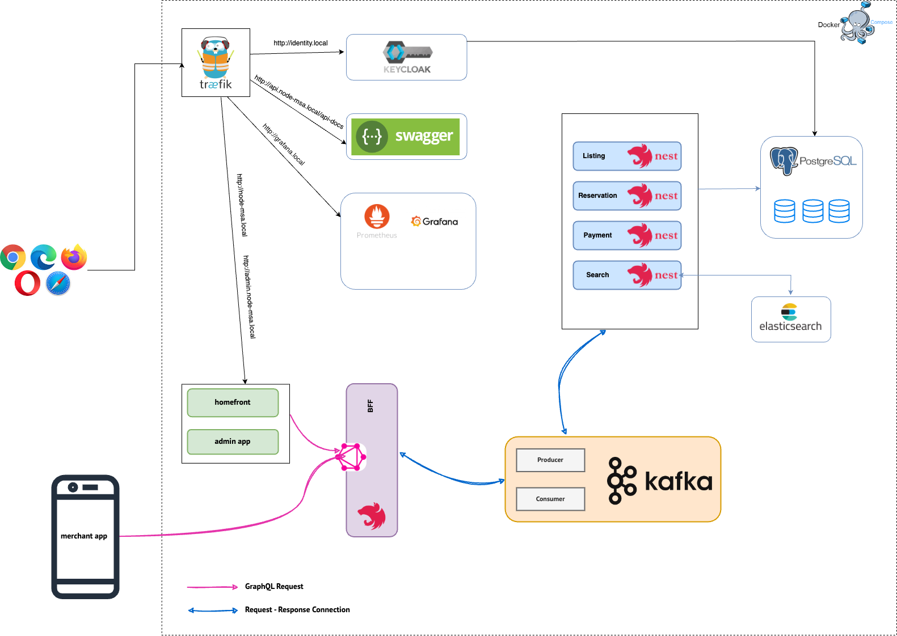

# NodeJS MSA

We try to build a simple room booking to make the best practices NodeJS in MSA. 

[](https://github.com/nashtech-garage/nodejs-msa/actions/workflows/bff-ci.yml)
[](https://github.com/nashtech-garage/nodejs-msa/actions/workflows/listing-ci.yml)
[](https://github.com/nashtech-garage/nodejs-msa/actions/workflows/reservation-ci.yml)
[](https://github.com/nashtech-garage/nodejs-msa/actions/workflows/payment-ci.yml)
[](https://github.com/nashtech-garage/nodejs-msa/actions/workflows/search-ci.yml)
[](https://github.com/nashtech-garage/nodejs-msa/actions/workflows/adminpage-ci.yml)

## Technical stack

* [TypeScript](https://www.typescriptlang.org) language
* [NodeJs](https://nodejs.org) / [NestJS v9](https://github.com/nestjs/nest)
* [NextJS v13](https://nextjs.org)
* [Flutter v3.3](https://flutter.dev)
* [Keycloak](https://www.keycloak.org)
* [Kafka](https://kafka.apache.org)
* [PostgreSQL](https://www.postgresql.org)
* [Docker](https://www.docker.com)
* [Terraform](https://www.terraform.io)
* [FluxCD](https://fluxcd.io)
* [Kustomize](https://kustomize.io)
* [Kubernetes](https://kubernetes.io)

## Local Development Architecture


## Getting started with Docker Compose
1. Get the latest source code
2. Add the following records to your host file:
   ```sh
   127.0.0.1 identity.local
   127.0.0.1 node-msa.local/api-docs
   127.0.0.1 node-msa.local
   127.0.0.1 admin.node-msa.local 
   ```
To edit the hosts file on macOS or Unix-based systems:
   ```sh
   sudo nano /etc/hosts 
   ```
To edit the hosts file on Windows:

1. Open Notepad or any text editor as Administrator.
2. Open the file located at C:\Windows\System32\drivers\etc\hosts.
3. Add the above records to the file and save it.
4. Start the Docker Compose services:
```sh
docker-compose up -d
```
5. Ensure your services are properly labeled to be picked up by Traefik.
Accessing the Traefik Dashboard:
Traefik dashboard will be available at http://localhost:8080

## Service Documentation
This document provides an overview of the different services used in the project, including details on their implementation languages and functionalities

| NO | Service             | Language    | Description                                                                                                  |
| -- | ------------------- | ----------- | ------------------------------------------------------------------------------------------------------------ |
| 1  | homefront           | Typescript  | Homepage for listing all available rooms, show room detail, price and provide reservation function to guest. |
| 2  | merchant app        | Dart        | Provide a mobile app for merchant to manage their rooms, view booking detail, ...                            |
| 3  | admin app           | Typescript  | A web application for admin to manage users, rooms and bookings                                              |
| 4  | BFF                 | Typescript  | Prepare a GraphQL gateway for homefront, merchant app to communicate with internal services                  |
| 5  | identity            |             | Provide OIDC authentication                                                                                  |
| 6  | listing-service     | Typescript  | Lists rooms, views room detail, price...                                                                     |
| 7  | reservation-service | Typescript  | Manage room reservation                                                                                      |
| 8  | payment-service     | Typescript  | Processes payment                                                                                            |
| 9  | message-broker      |             | A Kafka instance                                                                                             |

## Infrastructure


## Documentation
- [Development guide](docs/development-guide.md)

## Sponsors


