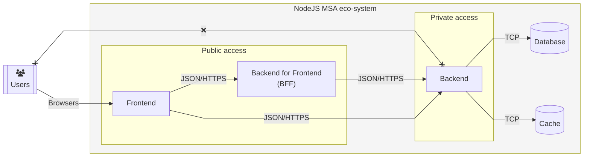

# Containerize

```mermaid
%%{ init : { "flowchart" : { "curve" : "linear" }}}%%
flowchart LR
  users[[fa:fa-users\nUsers]]

  subgraph nodeJsMas["NodeJS MSA eco-system"]
    direction LR
    subgraph publicAccess["Public access"]
      fe[Frontend]
      bff["Backend for Frontend\n(BFF)"]
    end

    subgraph privateAccess["Private access"]
      be[Backend]
    end

    db[(Database)]
    cache[(Cache)]
  end

  users -- Browsers --> fe
  users x-- "❌" --x be

  fe -- JSON/HTTPS --> bff
  bff -- JSON/HTTPS --> be
  fe -- JSON/HTTPS --> be

  be -- TCP --> db
  be -- TCP --> cache

  style nodeJsMas fill:whitesmoke
```
