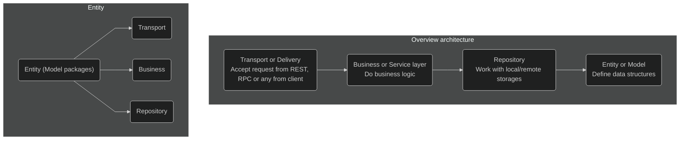

# Convention

Define documents/CI rules for convention (best practices) in NodeJS

## CI

- Eslint recommended rules
- Typescript eslint recommended rules
- Prettier formatter rules
- SonarJS recommended rules

## Naming convention

TBD

## Application architecture

