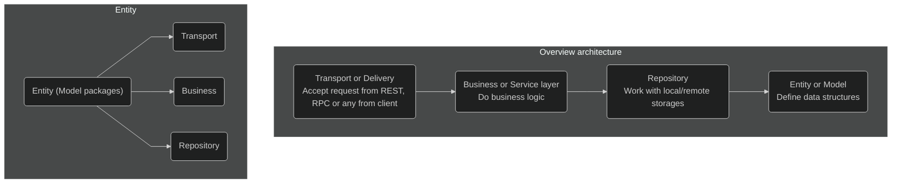

# Convention

Define documents/CI rules for convention (best practices) in NodeJS

## Naming cheatsheet

Naming things is hard. This sheet attempts to make it easier.

Although these suggestions can be applied to any programming language, I will use JavaScript to illustrate them in practice.

### English language

Use English language when naming your variables and functions.

```js
/* Bad */
const primerNombre = 'Gustavo'
const amigos = ['Kate', 'John']

/* Good */
const firstName = 'Gustavo'
const friends = ['Kate', 'John']
```

> Like it or not, English is the dominant language in programming: the syntax of all programming languages is written in English, as well as countless documentations and educational materials. By writing your code in English you dramatically increase its cohesiveness.

### Naming convention

Pick **camelCase** naming convention and follow it.

```js
/* Bad */
const page_count = 5
const active = true
const ShouldUpdate = true

/* Good */
const pageCount = 5
const isActive = true
const shouldUpdate = true
```

### S-I-D

A name must be short, intuitive and descriptive:

- **Short** A name must not take long to type and, therefore, remember;
- **Intuitive** A name must read naturally, as close to the common speech as possible;
- **Descriptive** A name must reflect what it does/possesses in the most efficient way.

```js
/* Bad */
const a = 5 // "a" could mean anything
const isPaginatable = a > 10 // "Paginatable" sounds extremely unnatural
const shouldPaginatize = a > 10 // Made up verbs are so much fun!

/* Good */
const postCount = 5
const hasPagination = postCount > 10
const shouldPaginate = postCount > 10 // alternatively
```

### Avoid contractions

Do not use contractions. They contribute to nothing but decreased readability of the code. Finding a short, descriptive name may be hard, but contraction is not an excuse for not doing so.

```js
/* Bad */
function getUsrNme() {
  // ...
}

/* Good */
function getUserName() {
  // ...
}
```

### Avoid context duplication

A name should not duplicate the context in which it is defined. Always remove the context from a name if that doesn't decrease its readability.

```js
class UserService {
  /* Method name duplicates the context (which is "User") */
  getUserSettings(event) { 
    // ...
  }

  /* Reads nicely as `userService.getSettings()` */
  getSettings(event) { 
    // ...
  }
}
```

### Reflect the expected result

A name should reflect the expected result.

```js
/* Bad */
const isEnabled = itemCount > 3
if(!isEnabled) {
  // ...
}

/* Good */
const isDisabled = itemCount <= 3
if(isDisabled) {
  // ...
}
```

### Naming functions

#### A/HC/LC pattern

There is a useful pattern to follow when naming functions:

Take a look at how this pattern may be applied in the table below.

```js
prefix? + action (A) + high context (HC) + low context? (LC)
```

|Name|Prefix|Action (A)|High context (HC)|Low context(LC)|
|--|--|--|--|--|
|`getUser`|--|`get`|`User`|--|
|`getUserMessages`|--|`get`|`User`|`Messages`|
|`shouldDisplayMessage`|`should`|`Display`|`Message`|--|
|`isPaymentEnabled`|`is`|`Enabled|Payment`|--|

##### Actions

The verb part of your function name. The most important part responsible for describing what the function does.

###### `get`

Accesses data immediately (i.e. shorthand getter of internal data).

```js
function getUserFullName() {
  return this.firstName + ' ' + this.lastName;
}
```

###### `set`

Sets a variable in a declarative way, with value `A` to value `B`.

```js
let fruits = 0;

function setFruits(nextFruits) {
  fruits = nextFruits;
}

setFruits(5);
console.log(fruits); // 5
```

###### `reset`

Sets a variable back to its initial value or state.

```js
const initialFruits = 5
let fruits = initialFruits
setFruits(10)
console.log(fruits) // 10

function resetFruits() {
  fruits = initialFruits
}

resetFruits()
console.log(fruits) // 5
```

###### `fetch`

Request for some data, which takes some indeterminate time (i.e. database request).

```js
function getUsers() {
  return this.userRepository.createQueryBuilder()
    .where('user.isActive = :isActive', { isActive: true })
    .getMany();
}
```

###### `remove`

Removes something from somewhere.

For example, if you have a collection of selected filters on a search page, removing one of them from the collection is `removeFilter`, **not** `deleteFilter` (and this is how you would naturally say it in English as well):

```js
function removeFilter(filters, filterName) {
  return filters.filter((name) => name !== filterName)
}

const selectedFilters = ['price', 'availability', 'size']
removeFilter(selectedFilters, 'price')
```

###### `delete`

Completely erases something from the realms of existence.

Imagine you are a content editor, and there is that notorious post you wish to get rid of. Once you clicked a shiny "Delete post" button, the CMS performed a `deletePost` action, not `removePost`.

```js
function deleteUser(id) {
   return this.userRepository.delete(id);
}
```

###### `compose`

Creates new data from the existing one. Mostly applicable to strings, objects, or functions.

```js
function composePageUrl(pageName, pageId) {
  return (pageName.toLowerCase() + '-' + pageId)
}
```

##### Context

A domain that a function operates on.

A function is often an action on something. It is important to state what its operable domain is, or at least an expected data type.

```js
/* A pure function operating with primitives */
function filter(list, predicate) {
  return list.filter(predicate)
}

/* Function operating exactly on posts */
function getRecentPosts(posts) {
  return filter(posts, (post) => post.date === Date.now())
}
```

> Some language-specific assumptions may allow omitting the context. For example, in JavaScript, it's common that `filter` operates on Array. Adding explicit `filterArray` would be unnecessary.

##### Prefixes

Prefix enhances the meaning of a variable. It is rarely used in function names.

###### `is`

Describes a characteristic or state of the current context (usually `boolean`).

```js
const color = 'blue'
const isBlue = color === 'blue' // characteristic
const isPresent = true // state

if (isBlue && isPresent) {
  console.log('Blue is present!')
}
```

###### `has`

Describes whether the current context possesses a certain value or state (usually `boolean`).

```js
/* Bad */
const isProductsExist = productsCount > 0
const areProductsPresent = productsCount > 0

/* Good */
const hasProducts = productsCount > 0
```

###### `should`

Reflects a positive conditional statement (usually `boolean`) coupled with a certain action.

```js
function shouldUpdateUrl(url, expectedUrl) {
  return url !== expectedUrl
}
```

###### `min / max`

Represents a minimum or maximum value. Used when describing boundaries or limits.

```js
/**
 * Renders a random amount of posts within
 * the given min/max boundaries.
 */
function renderPosts(posts, minPosts, maxPosts) {
  return posts.slice(0, randomBetween(minPosts, maxPosts))
}
```

### Singular and Plurals

Like a prefix, variable names can be made singular or plural depending on whether they hold a single value or multiple values.

```js
/* Bad */
const friends = 'Bob'
const friend = ['Bob', 'Tony', 'Tanya']

/* Good */
const friend = 'Bob'
const friends = ['Bob', 'Tony', 'Tanya']
```

## Linting & formatting

Uses Typescript Eslint, and Prettier to catch errors and avoid bike-shedding by enforcing a common code style. 
Uses SonarJS to prevent code smell

- Eslint recommended rules
- Typescript eslint recommended rules
- Prettier formatter rules
- SonarJS recommended rules

### Languages

- Typescript/JavaScript is linted by Typescript Eslint and formatted by Prettier
- JSON is formatted by Prettier

### Scripts

#### Terminal

```zsh
# Lint all files without auto-fixing
$ yarn lint

# Lint all files, fixing many violations automatically
$ yarn lint:fix
```

> See `package.json` to update

#### Pre-commit

Staged files are automatically linted and tested before each commit.

> [Husky](https://www.npmjs.com/package/husky) improves your commits and more 🐶 woof!

#### Editor

In supported editors, all files will be linted and show under the linter errors section.

### Configuration

See `.eslintrc.js` for more information and defined rules

## Application architecture


